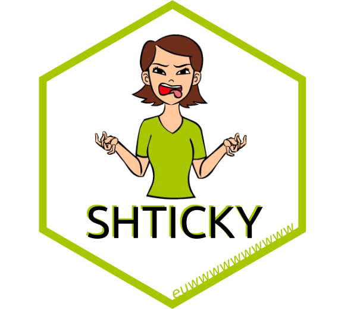

# shticky



Make 'Shiny' element shticky.

## Installation

``` r
# install.packages("remotes")
remotes::install_github("JohnCoene/shticky")
```

## How-to

1. Initialise shticky shtuff with the `new` method.
2. Make the element shticky with `shticky`.
3. Unshtick the element with the `unshtick` method.

Note that the `new` method takes an `id`.

## Example

``` r
library(shiny)
library(shticky)

longdiv <- function(...){
  div(style = "min-height:100vh;", ...)
}

ui <- fluidPage(
  use_shticky(),
  h1(id = "stick", "SHTICKY"),
  longdiv(),
  longdiv(),
  actionButton("unstick", "UNSHTICK"),
  longdiv(),
)

server <- function(input, output, session) {
  shtick <- Shtick$
    new("stick")$
    shtick(top = 200)

  observeEvent(input$unstick, {
    shtick$unshtick()
  })
}

shinyApp(ui, server)
```

